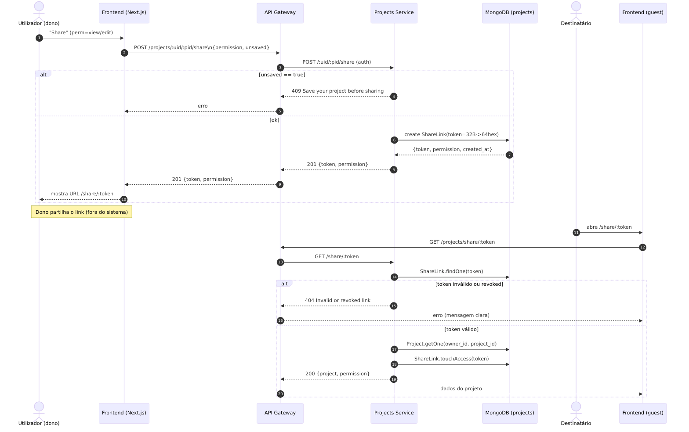
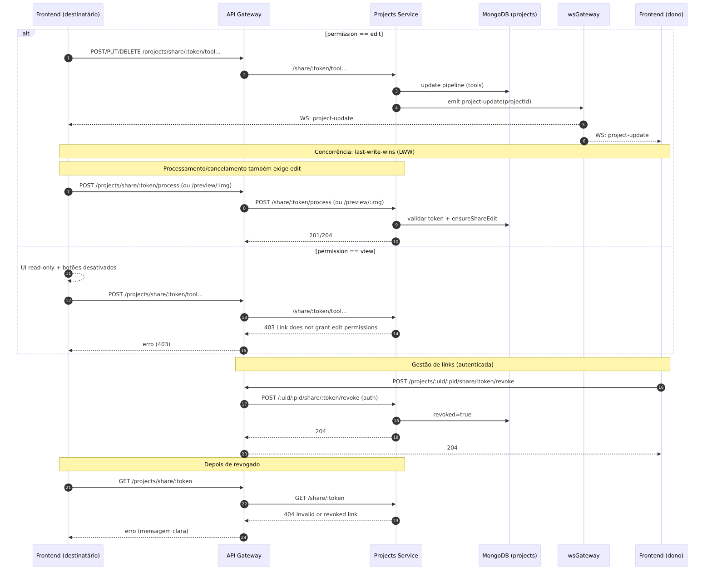

# PictuRAS — Fase 2
## UC07: Partilhar Projeto + Manutenção Corretiva

**Data:** 14/01/2026

<!--
Notas:
- Objetivo: orientar a discussão com foco no UC07 e nas correções pedidas.
- Fontes: docs/relatorio.md e doc-sol-arquitetura.pdf (quando disponível).
-->

---

# Apresentação

- **(2 min)** Diagrama(s) de sequência — UC07 “Partilhar Projeto”
- **(3 min)** Demonstração ao vivo — correções implementadas
- **(5 min)** Demonstração ao vivo — UC07 “Partilhar Projeto”

<!--
Notas:
- Manter o ritmo: 2/3/5 minutos.
- Se faltar tempo, reduzir a parte “correções” para 2 min e dar mais tempo ao UC07.
-->

---

# Enquadramento

- Arquitetura **microserviços** com **API Gateway**
- Processamento assíncrono via **RabbitMQ**
- Atualizações em tempo real via **wsGateway (WebSocket)**
- Persistência em **MongoDB** e objetos em **MinIO**

**Componentes principais:** Frontend (Next.js) · apiGateway · projects · users · subscriptions · imageStorageService · wsGateway

<!--
Notas:
- Este slide é o “mapa mental” para interpretar os diagramas seguintes.
-->

---

# UC07 — Objetivo

**Partilhar um projeto** através de um **link seguro**, permitindo:
- **VIEW**: consultar imagens/pipeline (sem editar)
- **EDIT**: editar pipeline e processar resultados

Requisitos cobertos (resumo):
- RF48–RF57 (UI, geração/gestão/revogação, erros claros)
- RNF49–RNF53 (token forte, geração local, persistência, concorrência LWW)

<!--
Notas:
- Realçar: acesso por link é “público” (sem login), mas limitado por token + permissões.
-->

---

# UC07 — Diagrama de Sequência (1/2)
## Criar link e abrir projeto partilhado

---

# UC07 — Diagrama de Sequência (2/2)
## Editar, propagar updates (WS) e revogar link

---

# Demo (3 min) — Manutencao Corretiva

**O que foi corrigido (Fase 2)**
- T-01/T-10: cancelamento de processamento (UI + backend + WS)
- T-06: reordenacao de ferramentas no pipeline (persistencia + atualizacao)

**O que vamos mostrar**
- Cancelar um processamento e confirmar recuperacao de estado
- Reordenar ferramentas e confirmar consistencia do projeto

<!--
Notas:
- Manter isto curto (30-40s) e passar para a demo.
-->
---

# Demo (5 min) — UC07: Partilhar Projeto

**Objetivo**
- O link é a “credencial”: **token forte** + **permissões** (view/edit) + **revogação**

**A demo consiste em:**
- Dono gera link (edit)
- Destinatário abre sem login e edita o projeto partilhado
- Alterações propagadas via **project-update (WS)**
- Processamento e resultados a partir do contexto partilhado

<!--
Notas (passo-a-passo):
- Ideal: 2 janelas lado a lado (dono autenticado + destinatário incognito).
- Dono: Share → Edit → Generate Link; copiar o URL.
- Destinatário: abrir /share/:token; confirmar “EDIT access”.
- Alterar pipeline e mostrar propagação (WS).
- Apply para gerar resultados; opcional: cancelar após ~10s.
-->

---

# Limitações e próximos passos

- Concorrência **LWW**: simples, mas pode sobrescrever alterações
- T-03 “parcial”: faltam testes/validação formal de RNF43

---

# PictuRAS — Fase 2
## UC07: Partilhar Projeto + Manutenção Corretiva

**Data:** 14/01/2026

